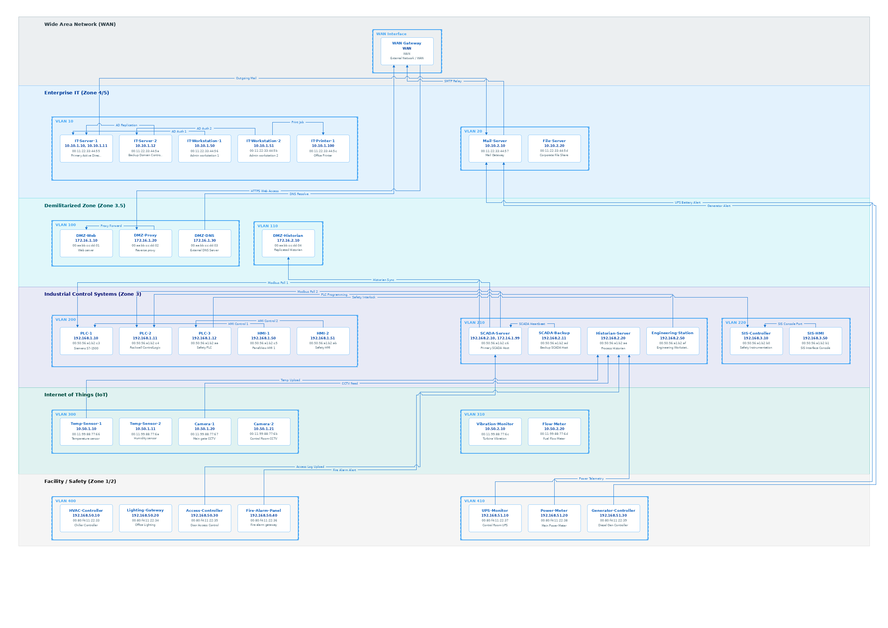
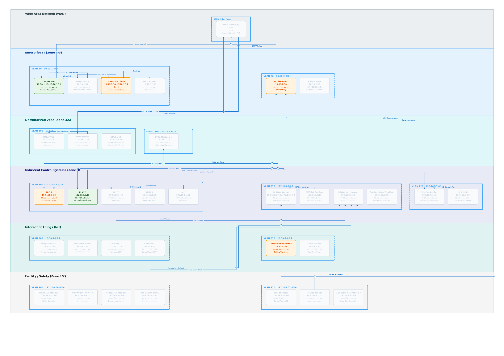

# OT Network Diagram Generator (`netdraw`)

A Python utility that generates rich, circuit-diagram-style network drawings for Operational Technology (OT) environments. By parsing simple asset, flow, and VLAN CSV files, it produces high-resolution static PNGs or interactive, self-contained HTML/SVG diagrams with zoom, pan, and layer/lens control capabilities.

## Sample Network Diagrams

### Standard View (Dynamic VLAN Subnets & Stacked Quantity Assets)


### State Lens Active View (State-Based Asset Color-Coding)


---

## Features

- **Standard OT Security Zones**: Stacks zones vertically (e.g., WAN, IT, DMZ, IACS, IoT, Facility) according to the Purdue Model. The canvas dynamically calculates and scales to the minimum required grid of A4 pages based on asset density.
- **Horizontal VLAN Sorting**: Auto-arranges VLANs side-by-side using a barycenter sweep heuristic to minimize flow line crossovers.
- **Asset Grid Layout**: Places devices inside their dashed VLAN borders in a clean 2D grid. Packs up to 5 assets horizontally per row.
- **Dynamic VLAN Labels & Boundaries**: Automatically expands the width of VLAN borders to accommodate descriptive labels incorporating IP CIDR ranges parsed from a VLAN mapping CSV.
- **System Quantities (Stacked Rectangles)**: Renders assets representing system quantities (using the `Quantity` column) as a stacked three-rectangle container displaying an IP range and quantity label without printing individual MAC addresses.
- **Generic State Lens**: Allows highlighting assets based on status (e.g., migration state) using customizable color styles configured in `config.json`. Generates an interactive toggled lens and color legend in the HTML diagram, and supports static lens rendering in PNG.
- **Orthogonal Flow Routing**: Routes connections vertically and horizontally through channels between zones. Automatically selects the shortest route, utilizing bypass corridors and lane spacing to prevent line overlaps.
- **Bridge Humps**: Automatically detects line crossings and renders semicircular arch "humps" at intersection points (supported in both SVG/HTML and PNG outputs).
- **Interactive HTML Canvas**: Embeds mouse-drag panning, mouse-wheel zooming, layer toggles, and state lens controls fully offline.

---

## Installation

`netdraw` requires **Python 3.x** and uses standard library modules.

### Requirements

To generate static **PNG** files, install the Pillow library:

```bash
pip install Pillow
```

*Note: Generating **HTML** diagrams has zero external dependencies.*

---

## Offline Security & Privacy

This utility is designed with **zero network dependency** and **strict privacy** in mind. It is safe for use on air-gapped systems or secure environments:

- **100% Local Execution**: The script operates entirely on your local machine. It does not initiate any internet connections or transmit data to external services.
- **Zero External CDNs/APIs**: The generated interactive HTML file is completely self-contained. It embeds standard SVG elements and system font styling with no remote libraries, tracker scripts, or external dependencies.

---

## Usage

Run `netdraw.py` by passing paths to your assets CSV, flows CSV, VLANs CSV (optional), and config JSON.

### Generate Interactive HTML (with Pan-Zoom & State Lens)

```bash
./netdraw.py -a sample_assets.csv -f sample_flows.csv -c config.json -v sample_vlans.csv -o map.html
```

### Generate High-Resolution PNG (with State Lens applied statically)

```bash
./netdraw.py -a sample_assets.csv -f sample_flows.csv -c config.json -v sample_vlans.csv --lens -o map.png
```

### CLI Arguments

- `-a`, `--assets`: Path to the assets CSV file (Required).
- `-f`, `--flows`: Path to the flows CSV file (Required).
- `-c`, `--config`: Path to the configuration JSON file (Default: `config.json`).
- `-v`, `--vlans`: Path to the VLANs CSV file containing CIDR mappings (Optional).
- `--lens`: Enable the configured generic state lens by default in HTML, or render it statically in PNG.
- `-o`, `--output`: Path to the output file (Generates `.html` or `.png` based on the extension).

---

## CSV File Formats

### 1. Assets CSV File (`assets.csv`)

Defines all network nodes, their IPs, MAC addresses, VLANs, security zones, quantities, and states.

| Header | Description | Example |
| :--- | :--- | :--- |
| **Hostname** | Name of the asset | `PLC-1` |
| **IP address** | IP address(es) (Semicolon `;` separated, or range for quantities) | `192.168.1.10;192.168.1.11` |
| **MAC address** | MAC Address of the asset (Omit/leave blank for quantities) | `00:50:56:a1:b2:c3` |
| **Comment** | Optional description or device details | `Siemens S7-1500 PLC` |
| **VLAN ID** | The VLAN number or ID containing the asset | `200` |
| **Zone** | Security Zone matching config's `zone_order` | `IACS` |
| **Quantity** | Optional quantity representing a system group | `3` |
| **State** | Optional state designation for lens styling (e.g. Migration State) | `To-be-migrated` |

#### Sample Assets File:
```csv
Hostname,IP address,MAC address,Comment,VLAN ID,Zone,Quantity,State
IT-Server-1,10.10.1.10,00:11:22:33:44:55,Primary Domain Controller,10,IT,,Dev
DMZ-Web,172.16.1.10,00:aa:bb:cc:dd:01,External Web Server,100,DMZ,,To-be-migrated
PLC-Group-1,192.168.1.10-192.168.1.14,,System Quantity Group,200,IACS,5,Aries
```

### 2. Flows CSV File (`flows.csv`)

Defines connections. Endpoint values can be specific **IP addresses** (matching individual or quantity-group IP ranges) or **VLAN IDs**.

| Header | Description | Example |
| :--- | :--- | :--- |
| **IP address source** | Flow source endpoint (Asset IP, VLAN ID, or `WAN`) | `192.168.1.10` or `200` or `WAN` |
| **IP address destination** | Flow destination endpoint (Asset IP, VLAN ID, or `WAN`) | `10.10.1.10` or `100` or `WAN` |
| **Comment** | Optional label shown centered on the flow line | `Modbus TCP` |

### 3. VLANs CSV File (`vlans.csv`)

Defines VLAN IDs and their associated subnets in CIDR notation.

| Header | Description | Example |
| :--- | :--- | :--- |
| **VLAN ID** | The VLAN number or ID (Unique Key) | `200` |
| **IP Range** | Subnet range in CIDR notation | `192.168.1.0/24` |

#### Sample VLANs File:
```csv
VLAN ID,IP Range
10,10.10.1.0/24
100,172.16.1.0/24
200,192.168.1.0/24
```

---

## Configuration (`config.json`)

Configure layout dimensions, defaults, color states/lens settings, and line styles.

```json
{
  "theme": "light",
  "output_format": "html",
  "dimensions": {
    "width": 1200,
    "height": 1697
  },
  "lens_column": "State",
  "states": {
    "To-be-migrated": {
      "fill": "#ffebee",
      "stroke": "#d32f2f",
      "text_color": "#c62828"
    },
    "Dev": {
      "fill": "#e8f5e9",
      "stroke": "#2e7d32",
      "text_color": "#1b5e20"
    },
    "Aries": {
      "fill": "#e3f2fd",
      "stroke": "#1565c0",
      "text_color": "#0d47a1"
    }
  },
  "zone_order": ["WAN", "IT", "DMZ", "IACS", "IOT", "Facility"],
  "zones": {
    "WAN": {
      "fill": "#eceff1",
      "stroke": "#b0bec5",
      "text_color": "#37474f",
      "label": "Wide Area Network (WAN)"
    }
  },
  "styles": {
    "vlan_border": {
      "stroke": "#42a5f5",
      "width": 2,
      "dasharray": "6,4"
    },
    "asset": {
      "fill": "#ffffff",
      "stroke": "#90caf9",
      "text_color": "#1565c0",
      "ip_color": "#0d47a1",
      "mac_color": "#546e7a"
    }
  }
}
```

---

## Validation & Warnings

The generator performs strict validation:
- **Subnet Mismatch Warns**: If an asset's IP is outside its declared VLAN CIDR range, `netdraw` prints a warning message and proceeds to draw the diagram.
- **Zone Exclusivity**: If a VLAN ID is declared in multiple zones across assets, `netdraw` aborts to prevent layout ambiguity.
- **Reference Integrity**: If a flow endpoint references an IP or VLAN not declared in assets, an error is generated detailing the row and missing value.
