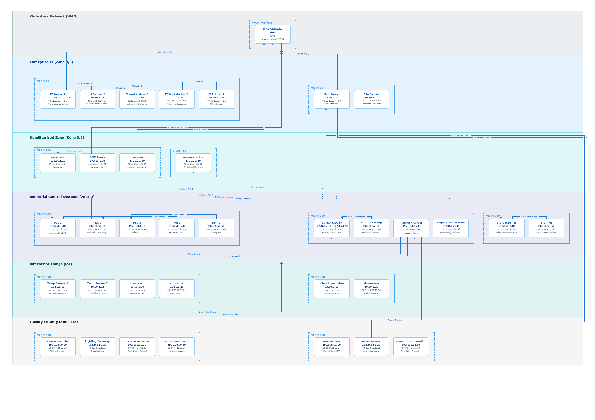
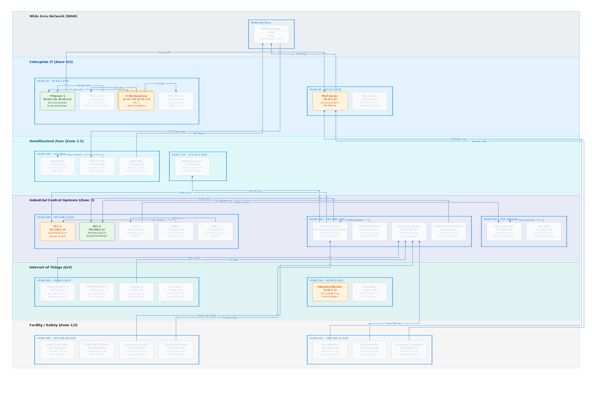

# OT Network Discovery & Diagram Toolkit

A set of Python utilities for discovering, cataloguing, and visualising assets and traffic flows on Operational Technology (OT) networks from packet captures.

| Tool | Purpose |
| :--- | :--- |
| **`netpipeline.py`** | Analyses pcap files with an optional starting asset list. Discovers assets, maps traffic flows, resolves VLANs, and exports clean CSV files. |
| **`netdraw.py`** | Generates network diagrams (PNG or interactive HTML) from the CSV files produced by `netpipeline`. |

---

## Quick Start

```bash
# 1. Run the pipeline against one or more pcaps (with optional asset list)
python3 netpipeline.py -p capture_01.pcapng capture_02.pcapng

# 2. (Optional) Generate a diagram from the results
python3 netdraw.py -a discovered_assets.csv -f discovered_flows.csv -v vlans.csv -o map.html
```

---

## Offline Security & Privacy

Both utilities are designed with **zero network dependency** and **strict privacy** in mind. They are safe for use on air-gapped systems or secure OT environments:

- **100% Local Execution**: Scripts operate entirely on your local machine. No internet connections are initiated and no data is transmitted externally.
- **Zero External Dependencies**: Generated HTML diagrams are fully self-contained with no remote libraries, CDNs, or tracker scripts.

---

## `netpipeline.py` — Network Discovery Pipeline

### What It Does

`netpipeline` takes **one or more packet captures** (and an optional **starting list of known assets**), then:

1. **Pre-validates PCAPs** using local Wireshark utilities (`capinfos`) to filter corrupt files upfront
2. **Parses traffic** using `tshark` with robust packet-by-packet error handling
3. **Displays real-time ETA progress** with throughput (pkts/sec) and completion estimates
4. **Discovers new assets** by following traffic connections transitively from your starting assets
5. **Resolves details** — fills in missing MAC addresses, hostnames, and VLAN IDs
6. **Detects DHCP changes** — updates IP addresses when a known MAC appears with a new IP
7. **Filters noise & groups high-ports** — ignores protocols and ports configured in `config.json`
8. **Classifies WAN traffic** — IPs not in RFC-1918, `vlans.csv`, or `config.json` CIDR ranges are treated as WAN
9. **Exports clean CSVs & Reports Summary** — exports asset, flow, and WAN log CSVs, appends new subnets to `vlans.csv`, and presents a run summary including earliest and latest packet timestamps

### Prerequisites

- **Python 3.6+** (standard library only, no pip dependencies)
- **tshark** and **capinfos** (part of [Wireshark](https://www.wireshark.org/download.html)) must be installed and available in PATH

### Team Workflow

The recommended workflow for a team sharing a common client engagement:

```
shared config/           Your pcap captures
┌──────────────────┐     ┌──────────────────┐
│ config.json      │     │ capture_01.pcapng │
│ vlans.csv        │     │ capture_02.pcapng │
│ protocols.csv    │     │ ...               │
│ assets.csv       │     └──────────────────┘
└──────────────────┘              │
         │                        │
         └────────┬───────────────┘
                  ▼
        python3 netpipeline.py \
          -i assets.csv \
          -p capture_01.pcapng capture_02.pcapng
                  │
                  ▼
        ┌──────────────────────┐
        │ discovered_assets.csv│  ← Enriched asset list
        │ discovered_flows.csv │  ← Traffic flows
        │ external.csv         │  ← WAN connection log
        │ vlans.csv (updated)  │  ← New subnets appended
        └──────────────────────┘
```

**Shared files** (commit to your repo):
- `assets.csv` — Starting list of known OT assets
- `vlans.csv` — Authoritative VLAN/subnet configuration
- `config.json` — Pipeline settings (ignore rules, CIDR ranges)
- `protocols.csv` — Protocol name lookup table

**Per-run outputs**:
- `discovered_assets.csv` — All assets with resolved details
- `discovered_flows.csv` — Filtered traffic flows
- `external.csv` — External/WAN connection log

To process multiple pcaps together or using wildcards:

```bash
python3 netpipeline.py -i assets.csv -p *.pcapng
```

### CLI Reference

```
usage: netpipeline.py [-h] [-i INPUT_ASSETS] -p PCAP [PCAP ...] [-v VLANS]
                      [-c CONFIG] [-a OUTPUT_ASSETS] [-f OUTPUT_FLOWS]
                      [-e EXTERNAL] [--append] [--protocols PROTOCOLS]
```

| Flag | Default | Description |
| :--- | :--- | :--- |
| `-i`, `--input-assets` | *(optional)* | Starting asset list CSV (if omitted, all discovered internal assets are in-scope) |
| `-p`, `--pcap`, `--pcaps` | *(required)* | One or more packet capture files (`.pcapng`, `.pcap`, `.pcapng.gz`) or glob patterns |
| `-v`, `--vlans` | `vlans.csv` | VLAN/subnet configuration CSV |
| `-c`, `--config` | `config.json` | Pipeline configuration JSON |
| `-a`, `--output-assets` | `discovered_assets.csv` | Output asset list |
| `-f`, `--output-flows` | `discovered_flows.csv` | Output flow list |
| `-e`, `--external` | `external.csv` | Output external WAN connection log |
| `--append` | off | Merge results into existing output files (prompts on conflicts) |
| `--protocols` | `protocols.csv` | Protocol name lookup CSV |
| `--high-port-min` | `49152` | Minimum port threshold for high-port range grouping |
| `--high-port-threshold` | `50` | Minimum count of high ports to trigger range grouping |
| `--high-port-gap` | `1000` | Maximum port gap between high ports to merge into a single range |


### How Discovery Works

1. **Starting assets** (optional): If provided, loaded from your input CSV. IPs in ranges (`10.0.0.1-10.0.0.5`) and multi-homed assets (`192.168.1.10;172.16.1.99`) are parsed automatically.
2. **Asset Scope & Discovery**:
   - **With starting assets**: Transitive discovery follows internal traffic connections from starting assets to discover connected devices.
   - **Without starting assets**: All internal (non-WAN) devices observed in packet traffic are automatically treated as in-scope assets.
3. **High-Port Range Grouping**: When more than 50 high-level ports (ports >= 49152) are detected between an endpoint pair and protocol, individual port entries are aggregated into a single consolidated range entry (e.g. `UDP49152-65535`) to reduce noise.
4. **WAN classification**: Any IP not in RFC-1918, not in `vlans.csv`, and not in a `config.json` CIDR range is classified as WAN. WAN IPs are **not** added to discovered assets — their flows appear as `WAN` in the flows CSV and details are logged to `external.csv`.
5. **VLAN resolution**: Each asset is assigned a VLAN ID by matching its IP against subnets in `vlans.csv`. New subnets not yet in `vlans.csv` are automatically appended with a placeholder letter ID (e.g. `A`, `B`, `C`) so you can fill in the real VLAN ID later.

---

## File Formats

### Input: Assets CSV (`assets.csv`)

Your starting list of known OT/IT assets.

| Column | Required | Description | Example |
| :--- | :--- | :--- | :--- |
| **Hostname** | Yes | Device name | `PLC-1` |
| **IP address** | Yes | IP address(es). Semicolon-separated for multi-homed, or range for groups | `192.168.1.10` or `10.0.0.1-10.0.0.5` |
| **MAC address** | No | MAC address (resolved automatically if blank) | `00:50:56:a1:b2:c3` |
| **Comment** | No | Description or device type | `Siemens S7-1500` |
| **VLAN ID** | No | VLAN number (resolved automatically from `vlans.csv` if blank) | `200` |
| **Quantity** | No | Number of devices in a group (used with IP ranges) | `5` |
| **State** | No | Custom state label for diagram lens styling | `to be migrated` |

```csv
Hostname,IP address,MAC address,Comment,VLAN ID,Quantity,State
PLC-1,192.168.1.10,00:50:56:a1:b2:c3,Siemens S7-1500,,,
HMI-Group,192.168.1.50-192.168.1.54,,PanelView HMIs,,5,
SCADA-Server,192.168.2.10;172.16.1.99,00:50:56:a1:b2:c6,Dual-homed SCADA,,,
```

### Input: VLANs CSV (`vlans.csv`)

Authoritative VLAN/subnet configuration. `netpipeline` reads this to classify IPs into VLANs and appends newly discovered subnets automatically.

| Column | Required | Description | Example |
| :--- | :--- | :--- | :--- |
| **VLAN ID** | Yes | VLAN number or identifier | `200` |
| **IP Range** | Yes | Subnet in CIDR notation | `192.168.1.0/24` |
| **Description** | No | Human-readable name (used in diagram labels) | `Manufacturing` |
| **Zone** | No | Security zone (used by `netdraw` for diagram layout) | `OT` |

```csv
VLAN ID,IP Range,Description,Zone
200,192.168.1.0/24,Manufacturing,OT
210,192.168.2.0/24,SCADA,OT
100,172.16.1.0/24,DMZ,DMZ
10,10.10.1.0/24,Servers,IT
```

### Input: Protocols CSV (`protocols.csv`)

Lookup table for mapping port numbers to human-readable protocol names.

| Column | Required | Description | Example |
| :--- | :--- | :--- | :--- |
| **Protocol** | Yes | `tcp` or `udp` | `tcp` |
| **Port** | Yes | Port number | `502` |
| **Name** | Yes | Protocol name | `Modbus` |

```csv
Protocol,Port,Name
tcp,502,Modbus
tcp,44818,EtherNet-IP
tcp,443,HTTPS
udp,53,DNS
```

### Output: Discovered Assets (`discovered_assets.csv`)

Enriched asset list with resolved MACs, hostnames, and VLAN IDs. Includes all starting assets plus any transitively discovered assets.

| Column | Description |
| :--- | :--- |
| **Hostname** | Original or passively resolved hostname |
| **IP address** | IP address (updated if DHCP change detected) |
| **MAC address** | Original or passively resolved MAC |
| **Comment** | Original comment, or `Passively Discovered OT-Related Asset` for new assets |
| **VLAN ID** | Resolved VLAN ID from `vlans.csv` |
| **Quantity** | Preserved from input |
| **State** | Preserved from input |

### Output: Discovered Flows (`discovered_flows.csv`)

All traffic flows between discovered assets, filtered by ignore rules.

| Column | Description | Example |
| :--- | :--- | :--- |
| **IP address source** | Source IP or `WAN` | `192.168.1.10` |
| **IP address destination** | Destination IP or `WAN` | `10.10.1.10` |
| **Comment** | Protocol or port range label | `TCP502 - Modbus` or `UDP49152-65535` |
| **Count** | Total packet count matching this flow | `1542` |

### Output: External WAN Log (`external.csv`)

Detailed log of all connections involving external (WAN) IP addresses.

| Column | Description | Example |
| :--- | :--- | :--- |
| **External IP** | The WAN IP address | `8.8.8.8` |
| **Hostname** | Resolved hostname (if observed via DNS) | `dns.google` |
| **Protocol** | TCP or UDP | `UDP` |
| **Port** | Port number | `53` |
| **Internal IP** | The internal asset IP | `10.10.1.50` |
| **Direction** | `inbound` or `outbound` | `outbound` |

---

## Configuration (`config.json`)

### Pipeline Settings

The `pipeline` section of `config.json` controls `netpipeline` behaviour:

```json
{
  "pipeline": {
    "ignore_protocols": ["WUDO", "LLMNR", "mDNS"],
    "ignore_ports": ["tcp:7680", "udp:5353", "udp:5355"],
    "cidr_ranges": ["1.2.0.0/16"]
  }
}
```

| Key | Description |
| :--- | :--- |
| `ignore_protocols` | Protocol names (from `protocols.csv`) to exclude from flows |
| `ignore_ports` | Specific `protocol:port` pairs to exclude |
| `cidr_ranges` | Additional CIDR ranges to treat as internal (non-WAN). Use this for non-RFC-1918 address space that is local to your network. |

### Diagram Settings

The remaining sections of `config.json` control `netdraw` diagram rendering:

| Key | Description |
| :--- | :--- |
| `theme` | `light` or `dark` |
| `dimensions` | Page dimensions `{ "width": 1200, "height": 1697 }` |
| `zone_order` | Ordered list of security zones top-to-bottom |
| `zones` | Per-zone colours and labels |
| `states` | Per-state colours for lens styling |
| `styles` | Asset, flow, and VLAN border styling |

---

## `netdraw.py` — Network Diagram Generator

Generates rich, circuit-diagram-style network drawings from the CSV files produced by `netpipeline` (or hand-authored CSVs).

### Features

- **Standard OT Security Zones**: Vertical zones (WAN, IT, DMZ, IACS, IoT, Facility) following the Purdue Model
- **Horizontal VLAN Sorting**: Barycenter sweep to minimise flow line crossovers
- **Asset Grid Layout**: Clean 2D grid inside dashed VLAN borders
- **Dynamic VLAN Labels**: Auto-expands to fit `"VLAN {ID}: {Description}"` labels from `vlans.csv`
- **System Quantities**: Stacked rectangles for asset groups with quantity labels
- **State Lens**: Colour-coded asset highlighting based on custom states
- **Orthogonal Flow Routing**: Vertical/horizontal routing with bridge humps at crossings
- **Interactive HTML**: Pan, zoom, layer toggles, and lens controls — fully offline

### Usage

```bash
# Interactive HTML diagram
python3 netdraw.py -a discovered_assets.csv -f discovered_flows.csv -v vlans.csv -o map.html

# Static PNG (requires Pillow: pip install Pillow)
python3 netdraw.py -a discovered_assets.csv -f discovered_flows.csv -v vlans.csv -o map.png

# PNG with state lens applied
python3 netdraw.py -a discovered_assets.csv -f discovered_flows.csv -v vlans.csv --lens -o map.png
```

| Flag | Default | Description |
| :--- | :--- | :--- |
| `-a`, `--assets` | *(required)* | Assets CSV file |
| `-f`, `--flows` | *(required)* | Flows CSV file |
| `-v`, `--vlans` | — | VLANs CSV file |
| `-c`, `--config` | `config.json` | Configuration JSON |
| `--lens` | off | Enable state lens (static in PNG, toggle in HTML) |
| `-o`, `--output` | — | Output file (`.html` or `.png`) |

### Sample Diagrams

#### Standard View


#### State Lens View


